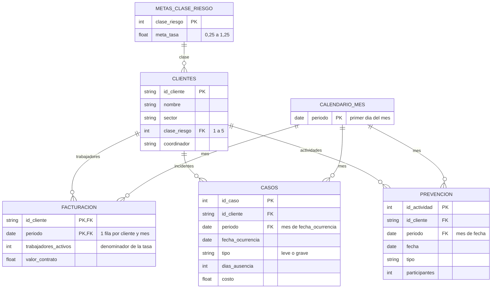

# Sección 4 — Tablero de monitoreo operativo

## Ejecución en 3 pasos

1. `pip install -r requirements.txt` (desde la raíz del repositorio)
2. `cd seccion_4`
3. `streamlit run app.py` → se abre en `http://localhost:8501`

## ¿Cómo lo conectaría a un Lakehouse en producción?

Solo cambiaría la función `generar_datos()` de `datos.py`; el resto del tablero no se entera. Leería las tablas gold ya validadas (no las crudas) desde el endpoint SQL del Lakehouse de Fabric con `pyodbc` o `sqlalchemy` y el driver ODBC 18, autenticando con una identidad de servicio (service principal de Entra ID) cuyas credenciales viven en variables de entorno o en Azure Key Vault, nunca en el código. Para no recalcular en cada clic, traería los datos agregados al grano mensual y usaría `st.cache_data` con un tiempo de vida alineado a la actualización diaria del pipeline (Sección 2.3), mostrando en el encabezado la fecha de corte real. Las metas pasarían a una tabla mantenida por el negocio. Para que cada coordinador vea solo sus clientes, la app lo identificaría con el inicio de sesión corporativo y aplicaría el mismo filtro de asignaciones que el RLS del modelo semántico; o bien consultaría directamente el modelo semántico de Power BI (API `executeQueries`) para heredar sus medidas y su seguridad sin duplicarlas.

## Modelo de datos

Esquema estrella: las dimensiones filtran a las tablas de hechos. Cada hecho se agrupa por mes antes de combinarse con los demás, porque tienen granularidades distintas.

## Para quién es y qué decide

**Usuario:** coordinador de cuentas (y su jefatura). **Momento:** el lunes, al planear la semana. **Decisión:** a qué clientes visitar y qué hacer con cada uno. Cada visual responde una pregunta de esa persona; si un visual no ayudaba a esa decisión, no entró.

## Estructura: tres páginas, de lo general al detalle

Sigue el principio de Shneiderman (1996): *primero la vista general, luego filtrar y hacer zoom, y el detalle a demanda*. Al detalle se llega con un clic, sin buscarlo.

| Página | Pregunta | Contenido | Cómo se llega |
|---|---|---|---|
| **Resumen** | ¿Vamos bien o mal y dónde hay que mirar? | Mensaje clave · 3 KPI con semáforo · métricas de apoyo · tendencia de 12 meses · sectores frente a su meta · top 10 clientes | Página inicial |
| **Diagnóstico** | ¿Por qué pasa y dónde se concentra? | Casos por tipo (leve/grave) · por clase de riesgo · mapa de calor sector × mes · todos los clientes | Clic en un sector, o en "Ver clientes de riesgo alto sin prevención" |
| **Ficha de cliente** | ¿Qué hago con este cliente? | Acción sugerida · tasa frente a su meta · evolución de 12 meses con meses sin prevención · casos y actividades | Seleccionar un cliente en cualquier tabla |

**Filtros** (siempre en la barra lateral, los mismos para las tres páginas): mes, coordinador ("mis clientes"), sector y clase de riesgo. Todos los visuales responden a ellos.

## KPI y métricas

Un indicador es **KPI** si cumple tres condiciones: está atado a un objetivo con meta, se revisa en cada reunión y, si se mueve un 20%, alguien hace algo distinto. Lo demás es **métrica de apoyo**: da contexto, pero no lleva semáforo.

| Indicador | Tipo | Meta | Por qué |
|---|---|---|---|
| Tasa de incidencia (casos × 100 trabajadores) | KPI de resultado | Según clase de riesgo (0,25 a 1,25) | Es el indicador central; se normaliza por tamaño para comparar clientes |
| Costo total de casos | KPI de resultado | Presupuesto = trabajadores × $22.000 | Impacto económico directo |
| Cobertura de prevención (clientes clase 4–5 con actividad en el mes) | KPI que anticipa | ≥ 90% | Es la palanca que controla el equipo: si baja, la tasa sube después |
| Casos del mes, casos graves, días de ausencia, clientes fuera de meta | Métricas de apoyo | — | Contexto. Los casos no llevan meta propia: su meta ya está en la tasa |

**La meta de tasa se ajusta por clase de riesgo**: exigirle lo mismo a una mina que a una oficina no es justo. La meta de un grupo de clientes es el promedio ponderado por trabajadores, así sigue siendo válida con cualquier filtro. Las metas son valores de ejemplo, configurables al inicio de `datos.py`.

## Principios de diseño aplicados

| Principio | Cómo se aplica | Referencia |
|---|---|---|
| Empezar por la decisión, no por los datos | Usuario, momento y decisión definidos antes de diseñar; títulos como preguntas del coordinador | Knaflic, *Storytelling with Data* (2015): contexto y audiencia primero |
| Historia de arriba hacia abajo | Mensaje clave → cómo vamos → ¿puntual o tendencia? → ¿dónde? → ¿con quién? | Knaflic (2015): la "gran idea" primero |
| Zonificación | Lo crítico arriba a la izquierda (mensaje clave y KPI principal); el detalle abajo | Patrones de lectura en F y en Z (Nielsen Norman Group, estudios de seguimiento ocular) |
| Ningún número sin contexto | Cada KPI con meta, % de cumplimiento, mes anterior y promedio de 12 meses | Few, *Information Dashboard Design* (2006) |
| Títulos que dicen la conclusión | Generados con los datos: "La tasa lleva 5 meses seguidos por encima de su meta" | Knaflic (2015) |
| El color comunica, no decora | Semáforo solo para estado frente a la meta; leve/grave en dos tonos de azul; controles en azul neutro para no confundir con el rojo de alerta | Few (2006); Tufte, relación datos-tinta (1983) |
| Semáforo accesible | Verde ≥100% de cumplimiento, amarillo 80–99%, rojo <80%; siempre con ícono (✓ ! ✕), texto y forma distinta en los gráficos | WCAG 2.1, criterio 1.4.1: el color no puede ser el único medio |
| Gráficos apropiados | Líneas para tendencia, barras para comparar, gráfico de bala para real vs meta, mapa de calor para sector × mes; sin tortas ni 3D | Cleveland y McGill (1984): posición y longitud se leen con más precisión; Few: *bullet graph* |
| Pocos visuales por página | 5 en Resumen, 4 en Diagnóstico, 4 en Ficha | Few (2006): se entiende "de un vistazo" |
| Autoexplicativo | Definición en el ícono ⓘ de cada indicador, fecha de corte visible, guía "¿Cómo leer este tablero?", aviso de filtros activos | — |
| Análisis temporal | Variación vs mes anterior, promedio de 12 meses, tendencia con meta, mapa de calor de 12 meses, rachas ("5 meses seguidos") | — |

## Por qué Streamlit

- **Python de punta a punta**: la misma lógica en pandas que usa el equipo de datos, sin una capa de JavaScript aparte.
- **Conexión a datos desde el servidor** (Lakehouse, SQL, APIs) sin exponer credenciales en el navegador, que es la limitación de un HTML estático.
- **Navegación entre páginas con clic** para el detalle a demanda, sin licencias y con un despliegue sencillo.
- Frente a Plotly Dash: Dash da más control de diseño, pero requiere bastante más código para el mismo resultado.

## Estructura del código

- `datos.py`: metas, generación de datos y **una sola definición de cada indicador** (serie mensual, semáforo, resumen por cliente, sectores, mapa de calor, acción sugerida). Se puede revisar sin abrir el tablero.
- `app.py`: solo presentación. Una función por página y por visual.
- `.streamlit/config.toml`: color de los controles (azul neutro).

**Medidas principales** (definidas una sola vez en `datos.py`):

| Medida | Cálculo |
|---|---|
| Tasa de incidencia | suma de casos / suma de trabajadores activos × 100 (nunca promedio de tasas) |
| Meta de tasa del grupo | suma(trabajadores × meta de su clase / 100) / suma de trabajadores × 100 |
| Presupuesto de costo | trabajadores activos × $22.000 |
| Cobertura de prevención | clientes clase 4–5 con al menos una actividad en el mes / clientes clase 4–5 |

